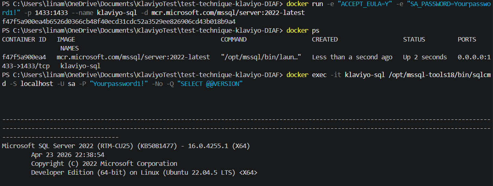
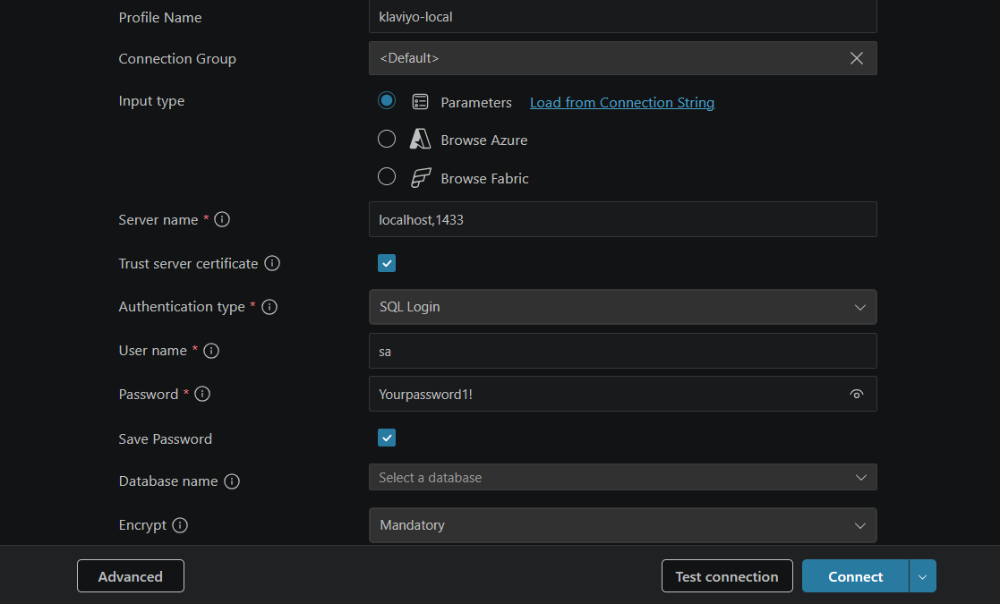
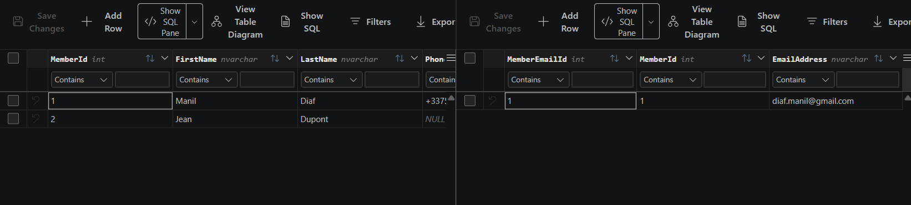
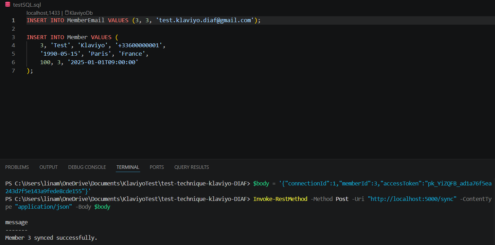
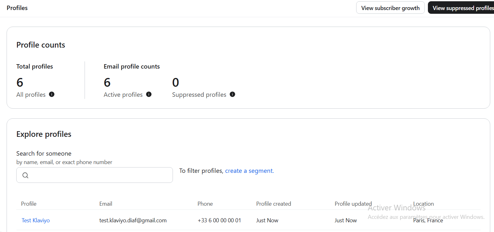

# Test Technique Klaviyo — Manil Diaf

## Présentation du projet

Ce projet est un test technique dont l'objectif est de **synchroniser un profil membre vers l'API Klaviyo** à partir d'une base de données SQL Server multi-tenant.

J'ai développé une Web API ASP.NET Core (.NET 9) qui expose un endpoint `POST /sync`. Quand on l'appelle, l'API va :

1. Identifier la bonne base de données grâce au `connectionId` (système multi-tenant)
2. Lire les données du membre en base de données via une requête ADO.NET
3. Construire un objet `KlaviyoMember` conforme au format attendu par l'API Klaviyo
4. Envoyer ce profil à l'endpoint `POST /api/profiles/` de Klaviyo

---

## Architecture du projet

```
KlaviyoTest/
├── Infrastructure/
│   ├── IDbConnectionFactory.cs         # Interface pour créer les connexions DB
│   ├── SqlConnectionFactory.cs         # Implémentation SQL Server
│   ├── ITenantConnectionResolver.cs    # Interface pour résoudre la connexion par tenant
│   └── TenantConnectionResolver.cs     # Lit la config appsettings.json
│
├── Klaviyo/
│   ├── Models/
│   │   └── KlaviyoMember.cs            # Modèles JSON (Member, Attributes, Location, Properties)
│   ├── Mappers/
│   │   ├── IKlaviyoMemberMapper.cs
│   │   └── KlaviyoMemberMapper.cs      # Requête SQL → objet KlaviyoMember
│   └── Services/
│       ├── IKlaviyoMemberSyncService.cs
│       ├── KlaviyoMemberSyncService.cs  # Orchestration : mapper + appel API
│       ├── IKlaviyoApiClient.cs
│       └── KlaviyoApiClient.cs          # Appel HTTP vers Klaviyo
│
├── KlaviyoTest.Tests/
│   ├── Mappers/
│   │   └── KlaviyoMemberMapperTests.cs  # Tests du mapper avec SQLite in-memory
│   └── Services/
│       └── KlaviyoMemberSyncServiceTests.cs  # Tests du service avec Moq
│
├── schema.sql                           # Schéma SQL Server fourni
├── appsettings.json
└── Program.cs                           # Endpoint POST /sync
```

---

## Choix techniques

### ADO.NET brut (pas d'Entity Framework)

J'ai choisi d'utiliser ADO.NET directement plutôt qu'Entity Framework car le test impose un schéma de base de données précis et une requête SQL spécifique (jointure `Member` + `MemberEmail`). ADO.NET me donne un contrôle total sur la requête, les paramètres, et la gestion des valeurs nulles colonne par colonne avec `IsDBNull`.

### Interfaces partout (`IDbConnectionFactory`, `ITenantConnectionResolver`)

J'ai systématiquement créé des interfaces pour chaque dépendance. Cela me permet de les **mocker dans les tests** sans toucher la logique réelle. Par exemple, je remplace `SqlConnectionFactory` par un mock qui retourne une connexion SQLite en mémoire dans les tests du mapper.

### Multi-tenant via `TenantConnectionResolver`

La résolution de la connexion par `connectionId` (pattern `Tenant_1`, `Tenant_2`…) était déjà en place dans l'infrastructure fournie. J'ai respecté ce contrat et je l'ai injecté dans le mapper.

### xUnit + Moq + SQLite pour les tests

- **xUnit** : framework de test standard en .NET
- **Moq** : pour mocker les interfaces (`IKlaviyoApiClient`, `ITenantConnectionResolver`, etc.)
- **Microsoft.Data.Sqlite** : pour tester le mapper **sans avoir besoin d'un SQL Server réel**. SQLite supporte le mode in-memory avec `Cache=Shared`, ce qui me permet de créer les tables, insérer des données de test, et vérifier le mapping — tout ça en mémoire, en isolation, sans aucune dépendance externe.

### Format des dates

- `BirthDate` → format `yyyy-MM-dd` (ex: `2002-10-21`)
- `EnrolledAt` → format ISO 8601 UTC avec `DateTime.SpecifyKind(..., DateTimeKind.Utc).ToString("o")` (ex: `2024-01-15T10:30:00.0000000Z`)

---

## Prérequis

- [.NET 9 SDK](https://dotnet.microsoft.com/download/dotnet/9)
- [Docker Desktop](https://www.docker.com/products/docker-desktop/) (pour SQL Server)
- Un compte Klaviyo avec une clé API (pour le test manuel en live)

---

## Étape 1 — Démarrer SQL Server avec Docker

Je n'avais pas SQL Server installé localement, j'ai donc utilisé l'image Docker officielle Microsoft :

```powershell
docker run -e "ACCEPT_EULA=Y" -e "SA_PASSWORD=Yourpassword1!" -p 1433:1433 --name klaviyo-sql -d mcr.microsoft.com/mssql/server:2022-latest
```

Pour vérifier que le conteneur est bien lancé :

```powershell
docker ps
```

Pour vérifier que SQL Server répond :

```powershell
docker exec -it klaviyo-sql /opt/mssql-tools18/bin/sqlcmd -S localhost -U sa -P "Yourpassword1!" -No -Q "SELECT @@VERSION"
```



---

## Étape 2 — Créer la base de données et les tables

Je me suis connecté à SQL Server via l’extension SQL Server (mssql) dans VS Code, en utilisant une authentification SQL Server.

Paramètres de connexion utilisés :

| Champ | Valeur |
|-------|--------|
| Profile name | klaviyo-local |
| Server name | localhost,1433 |
| Authentication type | SQL Login |
| Username | sa |
| Password | Yourpassword1! |
| Trust server certificate | activé |
| Database | KlaviyoDb |



```sql
-- Créer la base de données
CREATE DATABASE KlaviyoDb;
GO

USE KlaviyoDb;
GO
```

Puis j'ai exécuté le fichier `schema.sql` fourni (ou ces instructions directement) :

```sql
CREATE TABLE [dbo].[Member] (
    MemberId           INT            NOT NULL PRIMARY KEY,
    FirstName          NVARCHAR(100)  NOT NULL,
    LastName           NVARCHAR(100)  NOT NULL,
    PhoneNumber        NVARCHAR(20)   NULL,
    BirthDate          DATETIME       NULL,
    City               NVARCHAR(100)  NULL,
    Country            NVARCHAR(100)  NULL,
    LoyaltyPoints      INT            NOT NULL DEFAULT 0,
    MainEmailAddressId INT            NULL,
    EnrolledAt         DATETIME       NOT NULL
);

CREATE TABLE [dbo].[MemberEmail] (
    MemberEmailId INT            NOT NULL PRIMARY KEY,
    MemberId      INT            NOT NULL,
    EmailAddress  NVARCHAR(255)  NOT NULL
);
```

J'ai ensuite inséré des données de test :

```sql
INSERT INTO MemberEmail VALUES (1, 1, 'diaf.manil@gmail.com');

INSERT INTO Member VALUES (
    1, 'Manil', 'Diaf', '+33753490896',
    '2002-10-21', 'Lille', 'France',
    450, 1, '2024-01-15T10:30:00'
);

-- Membre sans email (pour tester les nulls)
INSERT INTO Member VALUES (
    2, 'Jean', 'Dupont', NULL,
    NULL, NULL, NULL,
    0, NULL, '2023-06-01T08:00:00'
);
```



---

## Étape 3 — Configurer `appsettings.json`

Voici l'exemple complet du fichier `appsettings.json` à renseigner :

```json
{
  "ConnectionStrings": {
    "Tenant_1": "Server=localhost,1433;Database=KlaviyoDb;User Id=sa;Password=Yourpassword1!;TrustServerCertificate=True;"
  },
  "Logging": {
    "LogLevel": {
      "Default": "Information",
      "Microsoft.AspNetCore": "Warning"
    }
  },
  "AllowedHosts": "*"
}
```


Pour un deuxième tenant (base de données différente), j'aurais ajouté :

```json
"Tenant_2": "Server=autre-serveur;Database=AutreDb;User Id=sa;Password=...;TrustServerCertificate=True;"
```

---

## Étape 4 — Lancer l'API

```bash
dotnet run 
```

L'API démarre sur `http://localhost:5000` (ou le port affiché dans la console).

Pour vérifier que l'API répond :

```powershell
Invoke-RestMethod -Uri "http://localhost:5000/"
# Réponse : Klaviyo Test API — OK
```

---

## Étape 5 — Récupérer une clé API Klaviyo

Pour tester l'appel réel vers Klaviyo :

1. Je me connecte sur [klaviyo.com](https://www.klaviyo.com)
2. Je vais dans **Settings → API Keys**
3. Je crée une clé privée avec la permission **Profiles** (Read & Write)
4. Je copie la clé (elle commence par `pk_...`)

---

## Étape 6 — Tester l'endpoint `/sync` manuellement

### Avec PowerShell

```powershell
$body = '{"connectionId":1,"memberId":3,"accessToken":"pk_VOTRE_CLE_KLAVIYO"}'

Invoke-RestMethod -Method Post -Uri "http://localhost:5000/sync" -ContentType "application/json" -Body $body
```

**Réponse attendue (succès) :**

```json
{ "message": "Member 3 synced successfully." }
```



**Réponse si le membre n'existe pas :**

```json
{ "error": "Member 999 not found." }
```

**Réponse si la clé Klaviyo est invalide :**

```json
{ "error": "Klaviyo API error 401: ..." }
```


### Vérification dans Klaviyo

Après un appel réussi, je vérifie dans mon dashboard Klaviyo :

1. **Audience → Profiles**
2. Je cherche l'email `test.klaviyo.diaf@gmail.com`
3. Je vérifie que les champs `first_name`, `last_name`, `phone_number`, `location`, `loyalty_points`, `enrolled_at`, et `birthday` sont bien présents



---

## Exécuter les tests

### Lancer tous les tests

```bash
dotnet test
```

## Tests implémentés

### `KlaviyoMemberMapperTests` (3 tests)

Ces tests utilisent **SQLite in-memory** — aucune connexion SQL Server n'est nécessaire.

| Test | Description |
|------|-------------|
| `GetMemberAsync_ReturnsMappedMember_WhenMemberExists` | Vérifie que tous les champs (email, nom, téléphone, ville, pays, points, date d'inscription, anniversaire) sont correctement mappés |
| `GetMemberAsync_ThrowsKeyNotFoundException_WhenMemberNotFound` | Vérifie qu'une exception `KeyNotFoundException` est levée pour un membre inexistant |
| `GetMemberAsync_HandlesNullableFields_WhenOptionalFieldsAreNull` | Vérifie que `PhoneNumber`, `Birthday`, et `Location` sont bien `null` quand les colonnes SQL sont `NULL` |

### `KlaviyoMemberSyncServiceTests` (7 tests)

Ces tests utilisent **Moq** pour simuler le mapper et le client Klaviyo. Les méthodes `[Theory]` avec plusieurs `[InlineData]` génèrent un test xUnit distinct par cas.

| Test | Cas | Description |
|------|-----|-------------|
| `SyncMemberAsync_DoesNotThrow_WhenApiReturnsSuccess` | HTTP 200 | Aucune exception levée pour une réponse OK |
| `SyncMemberAsync_DoesNotThrow_WhenApiReturnsSuccess` | HTTP 201 | Aucune exception levée pour une réponse Created |
| `SyncMemberAsync_ThrowsInvalidOperationException_WhenApiReturnsError` | HTTP 400 | `InvalidOperationException` levée sur BadRequest |
| `SyncMemberAsync_ThrowsInvalidOperationException_WhenApiReturnsError` | HTTP 401 | `InvalidOperationException` levée sur Unauthorized |
| `SyncMemberAsync_ThrowsInvalidOperationException_WhenApiReturnsError` | HTTP 500 | `InvalidOperationException` levée sur InternalServerError |
| `SyncMemberAsync_PropagatesKeyNotFoundException_WhenMemberNotFound` | — | L'exception du mapper remonte bien jusqu'à l'appelant |
| `SyncMemberAsync_CallsApiWithCorrectToken` | — | La clé API est bien transmise à Klaviyo |

---

## Comment j'ai testé le mapper sans SQL Server

Puisque les tests ne doivent pas dépendre d'une infrastructure externe, j'ai utilisé **SQLite in-memory** pour tester `KlaviyoMemberMapper`.

La stratégie est la suivante :

1. Je crée une connexion SQLite avec un nom de base unique (`KlaviyoTest_{Guid}`), en mode mémoire partagé (`Cache=Shared`)
2. Je garde cette connexion ouverte (`_keeper`) pendant toute la durée du test pour que la base en mémoire reste vivante
3. Je crée les tables `Member` et `MemberEmail` avec le même schéma que SQL Server
4. J'injecte un mock d'`ITenantConnectionResolver` qui retourne la chaîne de connexion SQLite
5. J'injecte un mock d'`IDbConnectionFactory` qui crée une nouvelle connexion SQLite (compatible avec le même cache partagé)
6. Je teste le vrai `KlaviyoMemberMapper` avec cette base de données légère

```csharp
// Exemple : la connexion "fantôme" qui garde la base en vie
_keeper = new SqliteConnection(_connStr);
_keeper.Open();

// Le factory mock retourne une vraie connexion SQLite à chaque appel
_factoryMock
    .Setup(f => f.CreateConnection(_connStr))
    .Returns(() => new SqliteConnection(_connStr));
```

Cette approche me permet de tester **100% de la logique de mapping SQL** (gestion des nulls, format des dates, jointure) sans avoir besoin de SQL Server. C'est rapide, reproductible, et fonctionne en CI/CD.

Si je n'avais pas eu accès à SQLite, j'aurais pu :
- Extraire la logique de construction du `KlaviyoMember` dans une méthode `Map(IDataReader reader)` testable indépendamment avec un mock d'`IDataReader`
- Ou utiliser un vrai SQL Server de test via une variable d'environnement CI

---

## GitHub Actions

Le workflow CI est dans [.github/workflows/tests.yml](.github/workflows/tests.yml).

Il se déclenche sur chaque `push` et `pull_request` vers `main`, et :
1. Installe .NET 9
2. Restaure les dépendances NuGet
3. Build en Release
4. Lance tous les tests
5. Archive les résultats `.trx` comme artefact

Les tests du mapper étant basés sur SQLite in-memory, **aucune base de données n'est nécessaire en CI**.

---

## Résumé des commandes

```powershell
# Démarrer SQL Server (Docker)
docker run -e "ACCEPT_EULA=Y" -e "SA_PASSWORD=Yourpassword1!" -p 1433:1433 --name klaviyo-sql -d mcr.microsoft.com/mssql/server:2022-latest

# Lancer l'API
dotnet run

# Lancer tous les tests
dotnet test

# Tester l'endpoint sync
$body = '{"connectionId":1,"memberId":1,"accessToken":"pk_VOTRE_CLE"}'
Invoke-RestMethod -Method Post -Uri "http://localhost:5000/sync" -ContentType "application/json" -Body $body
```
